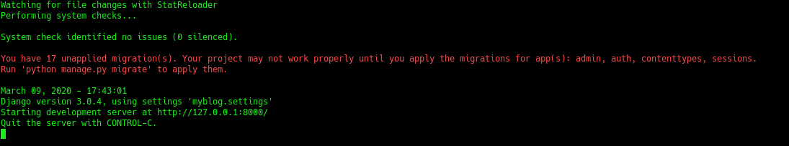
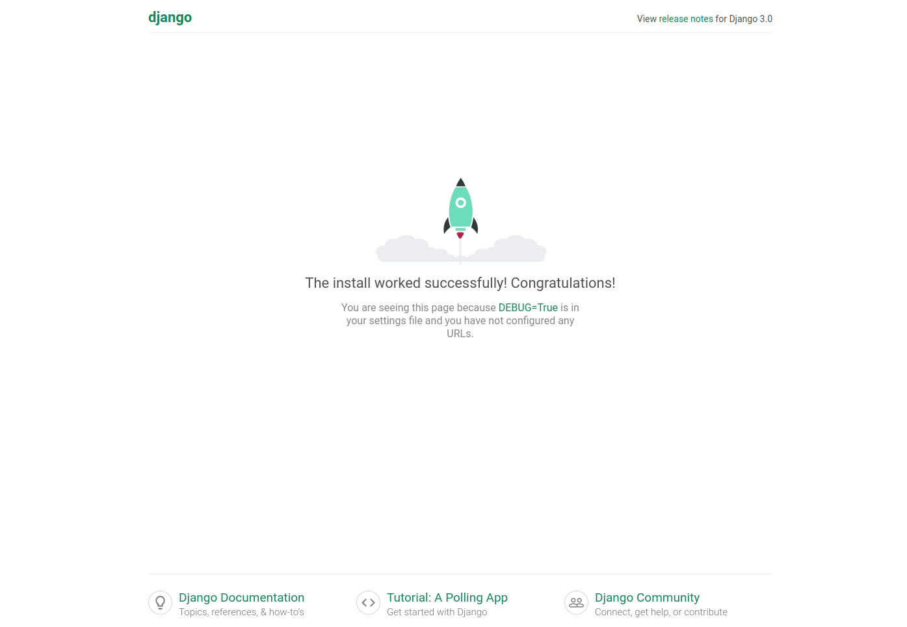

# Creating A Personal Blog Part 1: Setting Up The Environment

### Creating A Personal Blog Using Django, Nginx, And Google Cloud

### Category: Software Engineering 


Hi. In this blog series I am going to explain and show how I developed and deployed my blog, which you are reading
this post on. Before I continue, let me answer a few questions first.  

Why would you want to develop your own personal blog? Why would you want to have a personal blog anyway? You may wish so
for many reasons. Sharing your ideas, and knowledge, poetry that you enjoy or write yourself, 
places you travel to, things you cook, and etc. Well I have to admit that there are ton of social media platforms, where 
you can do all of the above, and share it with your friends easily. However, having a personal blog is ... Well, it is just 
personal. 

Let me put it in this way. Using a social media platform is similar to living in a building with lots of apartments inside.
Although you get to decide how you decorate your walls, your furniture, the structure of the building does not change 
much from apartment to apartment. And having a personal blog is like building up your own house from grounds up. You can
choose the location, your neighbours, how many bathrooms you will have, whether you will have a garden or not, and if so what 
kind of trees you will plant in it. 

Maybe I feel a little bit nostalgic about the _"back in my time"_ version of the internet, where everyone had their own
corner, and showcased whatever they wanted. Each page with its peculiar design and content, waiting to be discovered. 
And now, almost all of the content and traffic over the internet is concentrated into a few platforms, almost all
looking alike. So if you have decided to purchase a little corner of the internet for yourself, and build something 
that belongs to you, let's continue.

Oh, and last note before we go technical. There are many ways to build your own personal webpage. You can design it, and 
let someone else build it, use [Wordpress](https://wordpress.com/), and similar sites, or build it yourself. Taking up
on the last option will allow you more control in the process, and give you hands-on experience. 

That being said, I will document my experience of building a blog using Django (a python framework for 
building internet applications). To successfully follow this series of posts, recommended skills are: prior experience in 
programming, and developing applications (preferably in python, or a similar language), and experience with command 
line interface. Throughout this series, I will make some assumptions (such as your operating system being Linux, 
and etc.), and if those assumptions are wrong, then you also need some research skills (i.e. googling) to adopt the 
guide for your own situation. Let's begin our journey.

## What You Should Expect

In the end of this series, you should have a webpage very similar to the one you are viewing currently. We will use
Django (version 3.0.4), and Python (3.8) to develop the blog locally. Then we will use Nginx + Gunicorn to deploy the 
blog on a Google Cloud Instance. We will get to all of these in time. However, lets first setup our environment to start
the local development.

## Setting Up The Environment

I will be using Python 3.8 and Django 3.0.4, and will be developing on Linux platform (Arch Linux 5.5.7). 
Any linux environment should do for this series. I expect that you are able to adjust this tutorial for your needs, 
if you are using Windows.

First step is to determine whether you have python 3 installed on your system. Run the command below on command line. 

`python3 --version`

If the output is **`Python 3.8.x`** then you are good to go. If not you need to install python 3 to your system. You can
follow this [guide](https://docs.python-guide.org/starting/install3/linux/) for doing so on Ubuntu. 
Also feel free to google it for the operating system you are working on. In the end make sure you have Python 3.6 
(3.6.x or 3.7.x is also fine), by running `python3 --version` and getting the **`Python 3.8.x`** output.  

Now similarly we need to install pip3. Pip is a package manager for python. It makes installing, and maintaining python
packages extremely easy. So go ahead and try `pip3 --version` on the command line. If you get an output with 
`(python 3.8)` in the end, you are good to go. Otherwise you need to install pip3 to your system as well. Again here is a 
[guide](https://linuxize.com/post/how-to-install-pip-on-ubuntu-18.04/) showing how to do so on Ubuntu.

### Virtualenv and Virtualenvwrapper
Virtualenv is a tool to create virtual environments for python. If you run `pip3 list` you will see all of the packages
installed in your system. When starting a new python project, it is highly recommended to create virtual environments,
so that you can install packages that are specific to your project, which might be even different versions of the 
packages installed in your system. In this way, your packages for your projects can be kept separate from each other.
Virtualenv Wrapper is a tool to easily create and manage virtual environments. We need to install both of these packages
using pip. So go ahead and install [virtualenv](https://pypi.org/project/virtualenv/) and 
[virtualenvwrapper](https://virtualenvwrapper.readthedocs.io/en/latest/index.html)

`pip3 install virtualenv virtualenvwrapper`

If above command runs successfully, a script called virtualenvwrapper.sh should be downloaded to your system as well. 
And we need to find its location (I will explain the reason soon). It usually is downloaded to `/usr/local/bin/`. 
However if it is not there, you can find the location easily by running the following command.

`sudo find / -name virtualenvwrapper.sh`

Output of the above command will be the absolute path for virtualenvwrapper.sh file. If you do not get the path
as an output, then it means there was a problem in your installation and you should refer to the official pages 
of these two tools for more information and debugging.

Finally we should add these two lines to a shell startup file (file executed when a new shell is created), to configure
the location for our virtual environments, and the path for the virtualenvwrapper.sh script. So add these two lines
to `~/.basrhc` file. If you are familiar with any command line text editor, such as nano, go ahead and use it to do so.
Otherwise I recommend using [vim](https://www.vim.org/) (I assume you have vim installed, if not go ahead and 
install it, remember google is your best friend).

`vim ~/.bashrc`

Press `i` on your keyboard to enter the input mode, navigate down to the bottom of the file, and add these lines (If
you want to paste into a shell editor, remember to use `ctrl+shift+v` in command line). To quit the input mode, press 
`esc` and then type `:wq` to write and quit the file. If stuck, remember you can always find help online about vim. Or
try a different command line text editor, such as nano to edit the files.

```bash
# Virtualevnwrapper env variables
export WORKON_HOME=$HOME/Desktop/Envs
source /usr/bin/virtualenvwrapper.sh
```

First line starting with export, sets the folder where our virtual environments will be stored. Second line shows the
location of the installed script. This location should be the same one we found above, for virtualenvwrapper.sh. For me
it is `/usr/bin/virtualenvwrapper.sh`. If it is different in your system, please change it accordingly.

Now run the following command to finalize the installation of virtualenvwrapper.

`source ~/.bashrc`

At this point, we should have virtualenvwrapper insatlled and ready to use. To create a new virtual environment simply, 
run the below command.

`mkvirtualenv --python=python3 blog-env`

_blog-env_ is the name of my environment, and you can change it if you wish. After the execution of the command you 
should see (blog-env) in the beginning of your command line. This means that you are inside the 
blog-env virtual environment, and the packages you install here will not be affecting your system packages. In order to
exit this environment simply run `deactivate`. And your command line should turn back into normal. To activate
the virtual environment, run `workon blog-env`, and you should see (blog-env) in your terminal again. From now on make sure
that you are inside this virtual environment, every time you are executing python files related to this project.

Just to make sure, check that you have the python3 inside the blog-env as well. The command `python --version`
should give the `Python 3.8.x` output.

Congrats! You have achieved a significant amount of work today, and you deserve a pat on the back. However, before we are
done with today, I feel like we could do a little bit more. I promise it wont take much.

## Creating The Initial Django Project

Make sure that you are inside the blog-env ( (blog-env) should be visible in your terminal). Then install the 
Django package to your virtual environment.

`pip install django==3.0.4`

Since I am using django version 3.0.4 in this tutorial, and I have no idea what version will be out there when you are
reading this, for us to be in the same page you should also indicate the django version when installing it. 

Important note:
In the future, a security vulnerability might be found with django version 3.0.4, and if so you should use the most recent
version of the django for your project, and update the code and configuration accordingly. If you are simply following this
tutorial to learn django, and will not use this code in deployment, then version 3.0.4 should be fine.

Now create a directory you want to keep your project in, and go to that directory in the command line. 
For example, if I wanted to create a 'Blog' folder under 'Desktop', I would run the following commands in order.

```bash
cd ~/Desktop
mkdir Blog
cd Blog
```

Now you should be inside the _Blog_ folder. Then run the following command to create the initial Django project:

`django-admin.py startproject myblog`

This will create a folder called _myblog_, and inside should be a manage.py file and myblog folder. Change directory into
the newly created folder, where you will have the manage.py. And execute the manage.py with runserver keyword.

```bash
cd myblog
./manage.py runserver
```

Output of the command should be similar to this.



Never mind the warnings for now, I will explain and deal with it later. Now open your favorite browser and go to
the link provided in the output. For me it is http://127.0.0.1:8000/

You should see the following page:



Wonderful. You have successfully installed django, created your initial project, and run it successfully. We will
continue building our blog in the next part.

Source code for this tutorial up to this point can be found 
[here](https://github.com/gunduzhuseyn/Blog/tree/posts/posts/creating-a-personal-blog-part-1-setting-up-the-environment).