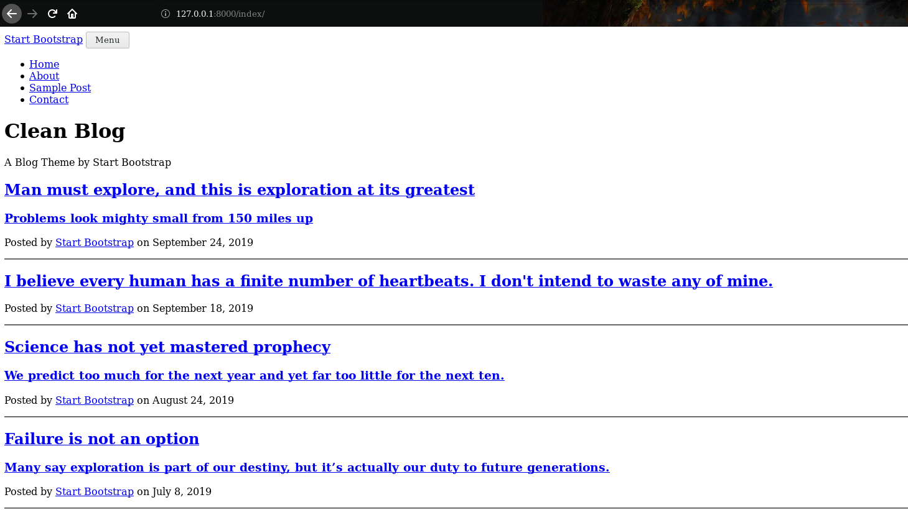
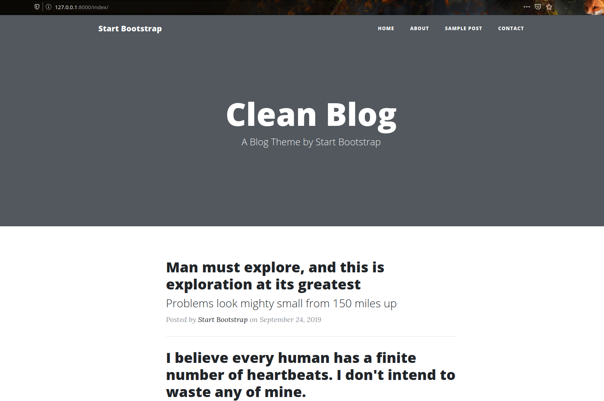

# Creating A Personal Blog Part 2: Integrating A Theme Into Django

### Creating A Personal Blog Using Django, Nginx, And Google Cloud

### Category: Software Engineering 


Hi. Welcome back to our journey of creating our special corner on the internet. I assume you have read and followed the
[part 1](https://gunduzhuseyn.com/posts/creating-a-personal-blog-part-1-setting-up-the-environment) of this series. If 
not, please go ahead and read (or skim) it before continuing. In this part, we are going to create our very own simple home 
page, and display a simple message, to get comfortable with the ropes of Django framework. Then we are going to
download and adopt a webpage theme to our own blog, to make it look prettier and more professional. So let's begin.


### Creating Simple Html Pages And Serving Them In Django

First we need to create our app inside the project. Django apps are like modules in a project. Creating them allows our code to be
modular, and easy to maintain. To create an app, first navigate to the project root directory, where manage.py lies. Also make sure that 
you are inside the 
_blog-env_ virtual environment we created in the previous part. If you have activated the virtual environment `(blog-env)` should 
be visible in your command line. If not simply run `workon blog-env`. Now to create a django app called _blog_, run the below command:

```bash
django-admin startapp blog
```

As a result, you should see a folder called _blog_ inside your project's root directory. Inside that folder you should have
python files such as _admin.py_, _models.py_, _views.py_ and etc. Most of our code will be written inside these files. But 
first lets add our app to the project. To do so, open up the _settings.py_ folder, under _myblog_ folder, which itself is
under the project root directory. From now on, you can use your favorite IDE (such as Sublime, Pycharm) to edit the 
source code. Add your app name, which is *blog* in my case, to `INSTALLED_APPS` list inside the _settings.py_ file. After 
doing that part of your _settings.py_ file should look like this: 

```
#!python
INSTALLED_APPS = [
    'django.contrib.admin',
    'django.contrib.auth',
    'django.contrib.contenttypes',
    'django.contrib.sessions',
    'django.contrib.messages',
    'django.contrib.staticfiles',
    'blog',
]
```

Good. Now to serve a page in Django, we need to do the following steps: First, we need to create an html page, which will
be shown to the user. Then we need to create a view, that will serve this page, and adjust the dynamic content if needed.
There are also models, which represent the objects in our webpage that needs to be stored. In our case actual posts that
we will write and publish will be represented as models (more on this in the next part). Finally, code inside _urls.py_
links (pun intended) the url patterns in our page to the corresponding views that serves html pages. I assume that 
you are somewhat familiar with this structure in a Django project, or at least are capable to google and figure things out 
on your own. I will try to be as clear as possible anyway.

So, Django by default, looks for html pages under the _templates_ folder, in order to serve them. Lets go ahead and create
_templates_ folder under our _blog_ app folder. It is a good practice to create a folder with same name as the app name,
inside the templates folder we just created. It might seem a little confusing, but for now bear with me. 
After creating all the folders, your project directory should look like this:


Now, create an html page called _home.html_ inside `/blog/templates/blog/` directory. And write the following code in this
file:

```
#!html
<!DOCTYPE html>
<html lang="en">
<head>
    <meta charset="UTF-8">
    <title>My Blog</title>
</head>
<body>
    <h1>Wazzup yo all!</h1>
</body>
</html>
```

At this point, we have our html page ready to be served. In this case it just displays a simple, warm welcome message to our users. Now we 
need to create a view that will serve this page. To do so, write the following code inside `/blog/views.py`:

```
#!python
from django.views.generic import TemplateView


class HomeView(TemplateView):
    template_name = 'blog/home.html'
```

TemplateView is a class provided by Django, which simply renders an html page, that is provided in the template_name 
parameter. In the above code, we pass the path (relative to the templates folder) of the html page we just created, to this parameter.
For the last step, we need to adjust the url settings in our project, so we can show our home page to our users. To do so first 
edit the `myblog/urls.py` file accordingly:

```
#!python
from django.contrib import admin
from django.urls import path, include

urlpatterns = [
    path('admin/', admin.site.urls),
    path('', include('blog.urls')),
]
```

Here we are telling Django to look for _urls.py_ file inside our _blog_ app, to match any url that starts with empty string 
(meaning all urls). If you are confused and want to know more about Django urls, you can check out the official 
documentation [here](https://docs.djangoproject.com/en/3.0/topics/http/urls/). Since we just told Django to look into
_urls.py_ file inside the blog app, we also need to create this file and add the following code inside it:

```
#!python
from django.urls import path

from .views import HomeView

urlpatterns = [
    path('home/', HomeView.as_view(), name='home_url'),
]
```

In the above code, we configure Django so that, if `home/` comes after the pattern declared in `myblog/urls.py` (which was empty string,
so the complete patter becomes : `'' + home/ => home/`), then we serve the HomeView view we implemented in _views.py_ file. Now start the 
server by running `python manage.py runserver`, from the root of the project. If you followed everything correctly, server
should start with no problem (with a warning complaining about the unapplied migrations, which you should not worry about
for now). If you try to go to `http://127.0.0.1:8000` now you should face with the following error screen:


Django error pages appear only in development mode, when the DEBUG variable in _settings.py_ is set to True. They come in
real handy most of the time, and usually are self explanatory. In this error page, Django is yelling at us that it tried 
all the url patterns it knows, and none of them matches an empty string we entered after our host address. If we add `home/`
to our host address (which is the pattern we linked to our HomeView view) and try to go to `http://127.0.0.1:8000/home/`, 
we should see our beloved page, and its message:


## Adopting A Theme

Cool. We now have our first page, to bravely convey all our ideas to the vast internet. However, a simple text on a 
white background, will probably not be enough to attract our dear readers. We can change things by adding custom css 
and javascript code to make things look better. However, since I am not good at designing and actually writing code
to make web pages look better, I usually tend to look for free (or paid if I have the resources) html+css+javascript templates 
on the internet, and integrate them into my project. One of such places where we can find free templates is 
[Start Bootstrap](https://startbootstrap.com/themes/). You can find other templates by googling as well. For my own blog, and 
for this tutorial I will be using [Clean Blog Theme](https://startbootstrap.com/themes/clean-blog/).
If you are very comfortable with Django, then feel free to choose another template. However if this is the case, I will just assume 
that you are capable to adjust the steps described in this series, into your own situation. Otherwise, you
should download the same theme for following this series. You can go ahead and choose your own theme (or even develop 
one) once you are more comfortable with Django.

Go ahead and download the source code for [Clean Blog Theme](https://startbootstrap.com/themes/clean-blog/).
As I am writing this post, the theme version is 5.0.8. In the future, author may stop maintaining 
this theme, or alter it significantly. So in order for us to be on the same page, you can also download it from my 
[github repo](https://github.com/gunduzhuseyn/Blog/tree/posts/posts/creating-a-personal-blog-part-2-integrating-a-theme-into-django/source%20code), 
where I uploaded the source code for this theme.

Copy 4 html documents (_about.html_, _contact.html_, _index.html_, _post.html_) from the Theme's source code into the 
`blog/templates/blog/` directory. Alongside the html files, there are some static content we need to copy as well. So 
create a folder called _static_ under the _blog_ app folder, and copy these folders, from the theme's source files, into 
the newly created folder: _css_, _scss_, _img_, _js_, and _vendor_. Now your project directory should look like this:


At this point, we have the html pages (i.e. templates) we want to render. So lets create views, and url patterns, to serve them 
using Django, as we did for our own _home.html_ page. Turns out, we can do so by changing only `blog/urls.py` file. We can create
TemplateViews inside _urls.py_ file, and pass in the paths for the html pages we want to render as template_name parameter, 
instead of creating additional views in _views.py_ file. To do so, change the `blog/urls.py` file accordingly:

```
#!python
from django.urls import path
from django.views.generic import TemplateView

from .views import HomeView

urlpatterns = [
    path('home/', HomeView.as_view(), name='home_url'),
    path('index/', TemplateView.as_view(template_name='blog/index.html'), name='index_url'),
    path('about/', TemplateView.as_view(template_name='blog/about.html'), name='about_url'),
    path('contact/', TemplateView.as_view(template_name='blog/contact.html'), name='contact_url'),
    path('post/', TemplateView.as_view(template_name='blog/post.html'), name='post_url'),
]
```

Now we are serving all 4 pages, in our blog. To see the result, navigate to `http://127.0.0.1:8000/index/`





Hmm... It seems that nothing incredible has improved in our style. There is just more text, still in plain html style. 
This is because Django does not handle linking css and javascript files traditionally, which are supposed to make our 
webpage prettier. So lets focus on making the _index.html_ work for now, and we will apply the same fixes to other pages later. 

In order to fix this issue, we need to change the `<link>` and `<script>` html tags that link to local css and javascript files. 
Simply, we need to add `` Jinja tag to the sources. We do not need to change those directed towards online files,
since they do not 'link' local static files. 

For example here are before and after (we apply changes) versions of these tags:

- Before: 
```
<link href="vendor/bootstrap/css/bootstrap.min.css" rel="stylesheet">
<script src="vendor/jquery/jquery.min.js"></script>
<link href='https://fonts.googleapis.com/css?family=Lora:400,700,400italic,700italic' rel='stylesheet' type='text/css'>
```

- After: 
```
<link href="" rel="stylesheet">`
<script src=""></script>`
<link href='https://fonts.googleapis.com/css?family=Lora:400,700,400italic,700italic' rel='stylesheet' type='text/css'>`
```

Also add `` tag to the beginning of the html file, after the `<title>` html tag, to let Django know it will be 
loading static files. Every time you use this `` tag in html, u need to load the tag beforehand as well.
Here is a partial code from _index.html_ (between the `<head>` tags) showing the changes:

```
#!html
<!DOCTYPE html>
<html lang="en">

<head>

    <meta charset="utf-8">
    <meta name="viewport" content="width=device-width, initial-scale=1, shrink-to-fit=no">
    <meta name="description" content="">
    <meta name="author" content="">

    <title>Clean Blog - Start Bootstrap Theme</title>

    

    <!-- Bootstrap core CSS -->
    <link href="" rel="stylesheet">

    <!-- Custom fonts for this template -->
    <link href="" rel="stylesheet" type="text/css">
    <link href='https://fonts.googleapis.com/css?family=Lora:400,700,400italic,700italic' rel='stylesheet' type='text/css'>
    <link href='https://fonts.googleapis.com/css?family=Open+Sans:300italic,400italic,600italic,700italic,800italic,400,300,600,700,800' rel='stylesheet' type='text/css'>

    <!-- Custom styles for this template -->
    <link href="" rel="stylesheet">

</head>

...
```

Do not forget to apply the same changes to the `<script>` tags at the very bottom of the code.
After adding these changes to _index.html_, our page now should look like this:





It looks much better now. Except the header image is not showing up correctly. To fix it we need to do two things. First we 
need to allow Django to serve static files in development server. Second, we need to adjust the url for img in html code. 

Lets add these two lines to the `myblog/settings.py` file:

```
#!python
STATIC_URL = '/static/'
STATIC_ROOT = os.path.join(BASE_DIR, 'static')
```

First line tells Django to serve the static content under urls starting with `/static/`. Second line tells where to look for
these static files. Now we need to change the `myblog/urls.py` file as well, in order to enable url patterns looking for
static content on our site. Remember this is only for serving static files on our development server, and should not be used for
deployment servers. For production we 
will use Nginx, which I will cover when we get to deployment part. If you want to know more about this topic, you can 
get more information [here](https://docs.djangoproject.com/en/3.0/howto/static-files/).
So change the `myblog/urls.py` file accordingly:

```
#!python
from django.conf import settings
from django.conf.urls.static import static

from django.contrib import admin

from django.urls import path, include

urlpatterns = [
    path('admin/', admin.site.urls),
    path('', include('blog.urls')),
]

if settings.DEBUG:
    urlpatterns = urlpatterns + static(settings.STATIC_URL, document_root=settings.STATIC_ROOT)

```

We are ready to serve static files now. All left to do, is to change the image sources in html, similar to sources in
html tags.
Here is an example of before and after versions:

- Before: 

`style="background-image: url('img/home-bg.jpg')`

- After: 

`style="background-image: url('/static/img/home-bg.jpg')`

Apply this change in the Page Header in _index.html_, and finally our page should look like this:


Congrats. Now our page looks more like a blog. 

## Jinja Magic
Before we go ahead and apply the same changes into our other 3 pages, let me introduce you with some Jinja wizardry.
If you were to go ahead and apply the changes we did for _index.html_, to other pages,
you would soon realize that you are changing the same css and javascript tags. Overall, you should realize that most of the code
in these pages are almost identical. Writing and managing redundant code inside the same project, is always a bad sign for a 
software developer. Using Jinja's extend, and include tags, we can get rid of this redundant code. 

For example, we can create a base file, to include all the code that is same for all of these pages. And by simply making
our html pages extend this base file, we will "inherit" all the code from the base file. Also we can create little code
snippets, for code blocks that are self contained, or are being used by different pages, and simply include them in
other pages. Hopefully it will become clearer, with some examples. So lets go ahead and create _base.html_ under 
`blog\templates\blog\` directory, and copy the content of _index.html_ into this file.

The code between the `<head>` tags are same for every page in our blog. So it definitely belongs to base.html. Inside 
`<body>`, the Navigation, Footer, and js scripts do not change from page to page either, so they should be inside this file as 
well. It seems we can create short snippets for the Navigation, and Footer, and then include them in _base.html_. 
So create _navbar.html_, and _footer.html_ files. Cut the Navigation part of the code from the base.html and paste it 
into _navbar.html_:

```
#!html
<!-- Navigation -->
<nav class="navbar navbar-expand-lg navbar-light fixed-top" id="mainNav">
    <div class="container">
        <a class="navbar-brand" href="index.html">Start Bootstrap</a>
        <button class="navbar-toggler navbar-toggler-right" type="button" data-toggle="collapse" data-target="#navbarResponsive" aria-controls="navbarResponsive" aria-expanded="false" aria-label="Toggle navigation">
            Menu
            <i class="fas fa-bars"></i>
        </button>
        <div class="collapse navbar-collapse" id="navbarResponsive">
            <ul class="navbar-nav ml-auto">
                <li class="nav-item">
                    <a class="nav-link" href="index.html">Home</a>
                </li>
                <li class="nav-item">
                    <a class="nav-link" href="about.html">About</a>
                </li>
                <li class="nav-item">
                    <a class="nav-link" href="post.html">Sample Post</a>
                </li>
                <li class="nav-item">
                    <a class="nav-link" href="contact.html">Contact</a>
                </li>
            </ul>
        </div>
    </div>
</nav>
```

Now we will be able to use this code in any of the other html pages, by simply calling it with `` tag, 
as we will use this in _base.html_. Another cool magic we can make use of is using dynamic urls for the `href` values in 
links, instead of hard coded ones.
This way if we change url patterns in _urls.py_ files, we will not need to update corresponding html elements. To 
achieve this, simply add `` inside the `href` tag. `url_name` should correspond to the name of the
url we defined in _urls.py_ file. For example, our new navigation links should look like this:

```
#!html
<!-- Navigation -->
<nav class="navbar navbar-expand-lg navbar-light fixed-top" id="mainNav">
    <div class="container">
        <a class="navbar-brand" href="index.html">Start Bootstrap</a>
        <button class="navbar-toggler navbar-toggler-right" type="button" data-toggle="collapse" data-target="#navbarResponsive" aria-controls="navbarResponsive" aria-expanded="false" aria-label="Toggle navigation">
            Menu
            <i class="fas fa-bars"></i>
        </button>
        <div class="collapse navbar-collapse" id="navbarResponsive">
            <ul class="navbar-nav ml-auto">
                <li class="nav-item">
                    <a class="nav-link" href="">Home</a>
                </li>
                <li class="nav-item">
                    <a class="nav-link" href="">About</a>
                </li>
                <li class="nav-item">
                    <a class="nav-link" href="">Sample Post</a>
                </li>
                <li class="nav-item">
                    <a class="nav-link" href="">Contact</a>
                </li>
            </ul>
        </div>
    </div>
</nav>
```

Similar to the navigation part of the code, cut the Footer section of the code and paste it in _footer.html_ file:

```
#!html
<!-- Footer -->
<hr>
<footer>
    <div class="container">
        <div class="row">
            <div class="col-lg-8 col-md-10 mx-auto">
                <ul class="list-inline text-center">
                    <li class="list-inline-item">
                        <a href="#">
                <span class="fa-stack fa-lg">
                  <i class="fas fa-circle fa-stack-2x"></i>
                  <i class="fab fa-twitter fa-stack-1x fa-inverse"></i>
                </span>
                        </a>
                    </li>
                    <li class="list-inline-item">
                        <a href="#">
                <span class="fa-stack fa-lg">
                  <i class="fas fa-circle fa-stack-2x"></i>
                  <i class="fab fa-facebook-f fa-stack-1x fa-inverse"></i>
                </span>
                        </a>
                    </li>
                    <li class="list-inline-item">
                        <a href="#">
                <span class="fa-stack fa-lg">
                  <i class="fas fa-circle fa-stack-2x"></i>
                  <i class="fab fa-github fa-stack-1x fa-inverse"></i>
                </span>
                        </a>
                    </li>
                </ul>
                <p class="copyright text-muted">Copyright &copy; Your Website 2019</p>
            </div>
        </div>
    </div>
</footer>
```

Delete the Page Header and Main Content parts of the code from _base.html_, and change it as shown below to 
include the above code snippets:

```
#!html
<!DOCTYPE html>
<html lang="en">

<head>

    <meta charset="utf-8">
    <meta name="viewport" content="width=device-width, initial-scale=1, shrink-to-fit=no">
    <meta name="description" content="">
    <meta name="author" content="">

    <title>Clean Blog - Start Bootstrap Theme</title>

    

    <!-- Bootstrap core CSS -->
    <link href="" rel="stylesheet">

    <!-- Custom fonts for this template -->
    <link href="" rel="stylesheet" type="text/css">
    <link href='https://fonts.googleapis.com/css?family=Lora:400,700,400italic,700italic' rel='stylesheet' type='text/css'>
    <link href='https://fonts.googleapis.com/css?family=Open+Sans:300italic,400italic,600italic,700italic,800italic,400,300,600,700,800' rel='stylesheet' type='text/css'>

    <!-- Custom styles for this template -->
    <link href="" rel="stylesheet">

</head>

<body>

    

    

    

    
    
    <!-- Bootstrap core JavaScript -->
    <script src=""></script>
    <script src=""></script>

    <!-- Custom scripts for this template -->
    <script src=""></script>

</body>

</html>
```

This way, our base file looks very clean. The include tags simply includes the codes, from the specified templates. When
Django renders these files, it will copy the code from included templates into this page, and render it together.
The `` and `` tags indicate the code location, for those pages that extend this page.
For example if _index.html_ extends this base file, and includes only the Page Header and Main Content parts of the code, all code
inside _index.html_ will be copied between these two tags when being rendered. So lets delete all the redundant code from
_index.html_ and change it as shown below, to extend the base file.

```
#!html



<!-- Page Header -->
<header class="masthead" style="background-image: url('/static/img/home-bg.jpg')">
    <div class="overlay"></div>
    <div class="container">
        <div class="row">
            <div class="col-lg-8 col-md-10 mx-auto">
                <div class="site-heading">
                    <h1>Clean Blog</h1>
                    <span class="subheading">A Blog Theme by Start Bootstrap</span>
                </div>
            </div>
        </div>
    </div>
</header>

<!-- Main Content -->
<div class="container">
    <div class="row">
        <div class="col-lg-8 col-md-10 mx-auto">
            <div class="post-preview">
                <a href="post.html">
                    <h2 class="post-title">
                        Man must explore, and this is exploration at its greatest
                    </h2>
                    <h3 class="post-subtitle">
                        Problems look mighty small from 150 miles up
                    </h3>
                </a>
                <p class="post-meta">Posted by
                    <a href="#">Start Bootstrap</a>
                    on September 24, 2019</p>
            </div>
            <hr>
            <div class="post-preview">
                <a href="post.html">
                    <h2 class="post-title">
                        I believe every human has a finite number of heartbeats. I don't intend to waste any of mine.
                    </h2>
                </a>
                <p class="post-meta">Posted by
                    <a href="#">Start Bootstrap</a>
                    on September 18, 2019</p>
            </div>
            <hr>
            <div class="post-preview">
                <a href="post.html">
                    <h2 class="post-title">
                        Science has not yet mastered prophecy
                    </h2>
                    <h3 class="post-subtitle">
                        We predict too much for the next year and yet far too little for the next ten.
                    </h3>
                </a>
                <p class="post-meta">Posted by
                    <a href="#">Start Bootstrap</a>
                    on August 24, 2019</p>
            </div>
            <hr>
            <div class="post-preview">
                <a href="post.html">
                    <h2 class="post-title">
                        Failure is not an option
                    </h2>
                    <h3 class="post-subtitle">
                        Many say exploration is part of our destiny, but it’s actually our duty to future generations.
                    </h3>
                </a>
                <p class="post-meta">Posted by
                    <a href="#">Start Bootstrap</a>
                    on July 8, 2019</p>
            </div>
            <hr>
            <!-- Pager -->
            <div class="clearfix">
                <a class="btn btn-primary float-right" href="#">Older Posts &rarr;</a>
            </div>
        </div>
    </div>
</div>


```

Now if you go to `http://127.0.0.1:8000/index/`, you will not see any visual difference in index page. If you analyze the source code of the
page, you will see that Django has combined all the code together and rendered it like that. 

Although refactoring code in this way may look complicated and tedious, it is actually a very well known software engineering practice
to create "functions" for the redundant code, and call them wherever they are needed. This way, if we need to change anything in navigation 
(spoiler: we will need to), we can change only the _navbar.html_, and update all other codes with the change. Or by simply
editing the _base.html_ file, we can add new changes to all other html files that extend from it.

Go ahead, and make other pages (_about.html_, _contact.html_, and _post.html_) extend the _base.html_, removing all the 
redundant code, and keeping only the code that is specific for the page (Page Header and Main/Post Content). 
If stuck you can always refer to the source code linked at the end of this post.


### Further Magic

Today you have achieved a lot, and you must be feeling proud with yourself. However, before completing today's post, I
feel like you should learn another Jinja trick. Hopefully you have already realized by now that Page Header section
of the code in all 3 pages (index, contact, and about), are very similar, differing in only three parameters: the background image url, title, 
and subtitle, and you are wondering whether we can further refactor this code using Jinja magic. Wonder no more! Turns out, we can create a 
snippet to include this shared code, and pass values for these parameters from the pages that include this snippet.

So lets create a _page_header.html_ and paste the following code inside it:

```
#!html
<!-- Page Header -->
<header class="masthead" style="background-image: url('{{ header_img_url }}')">
    <div class="overlay"></div>
    <div class="container">
        <div class="row">
            <div class="col-lg-8 col-md-10 mx-auto">
                <div class="page-heading">
                    <h1>{{ header_title }}</h1>
                    <span class="subheading">{{ header_subtitle }}</span>
                </div>
            </div>
        </div>
    </div>
</header>
```

Here instead of using hard coded values, we are using values for the three different parameters, that will be passed 
on to this snippet. For example inside _index.html_, remove the Page Header section of the code
and add this one `` tag to include the code inside _page_header.html_.

```
#!html






<!-- Main Content -->
<div class="container">
    ...
</div>

<hr>


```

As you see in the above code, we can supply values for specific parameters with `with` tag inside include
tag, and then later use these values inside the included snippet.

Apply the same change to both _about.html_ and _contact.html_, passing  their relative values to the include tag. After all this hard work,
visit your newly created pages, and you should see the following result:


Finally you now have a pretty looking blog. However, looks are not everything. We need great content as well. 
In the next part, we are going to implement a way to create and publish posts easily. See you soon!

Source code for this tutorial up to this point can be found 
[here](https://github.com/gunduzhuseyn/Blog/tree/posts/posts/creating-a-personal-blog-part-2-integrating-a-theme-into-django).