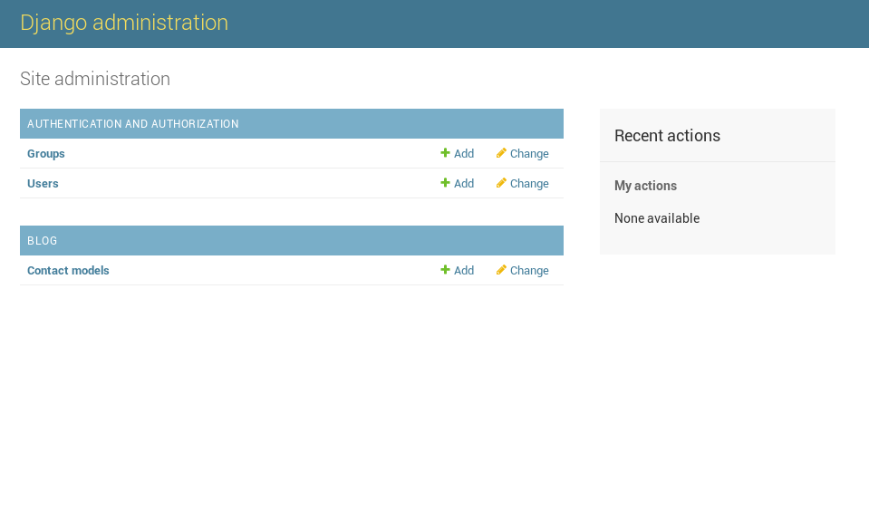
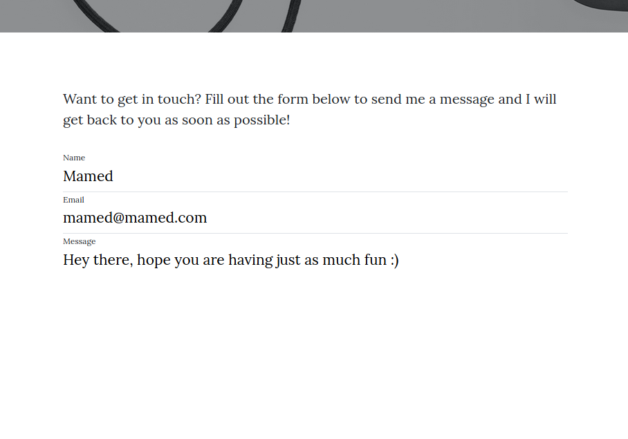
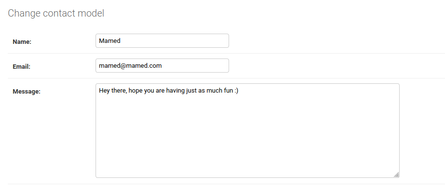
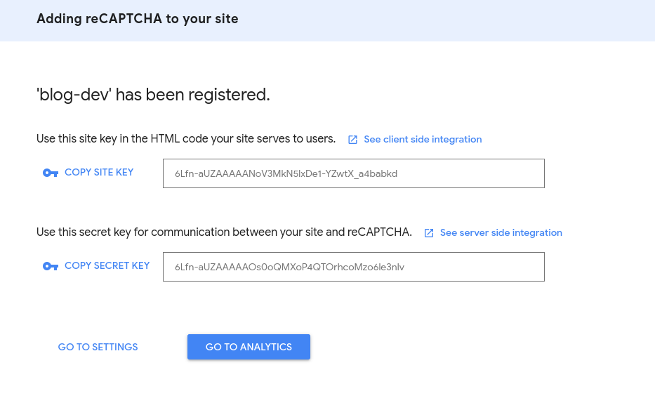
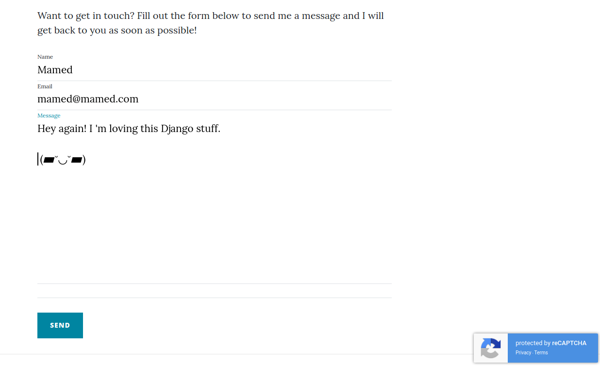

# Creating A Personal Blog Part 3: Adding Contact Functionality and Google ReCAPTCHA V3 to Django

### Creating A Personal Blog Using Django, Nginx, And Google Cloud

### Category: Software Engineering 

Hi, and welcome back. In the last part, 
[part 2](https://gunduzhuseyn.com/posts/creating-a-personal-blog-part-2-integrating-a-theme-into-django) of our series, 
I showed you how to download a css theme and integrate it
to our little django project, to make our blog look prettier. However as I said in the previous post, we need great content
as well as the great looks. So we need to be able to create, edit, and publish our posts. 

To do so, we need to create database models to represent our posts, and integrate those models with fronted so we can
filter and show them as needed. If you are not familiar with these concepts, don't worry. To make you get used to the
ropes, I will start small, and simple. In fact, this post will only explain how to enable our users to submit contact
messages to us. By adding this feature, we are dealing with a lot of similar issues that will show up in the future.

## Adding Contact Functionality

So, let's start by providing a contact page for our users, so that they can contact us. If you followed the
previous posts, and used the same theme, you should notice that we already have a contact page. In fact if you 
navigate to `http://127.0.0.1:8000/contact/` you will see a nice form where you can submit your messages. 
Currently theme uses javascript to forward the
messages submitted by the users, and if you are proficient in js, it is totally up to you to handle it in this way.
Personally, I would like to use  the Django framework to save the messages in my database.

To save the messages, lets create our first database model, inside _blog/models.py_ file.

```
#!python
from django.db import models


class ContactModel(models.Model):
    name = models.CharField(max_length=50)
    email = models.EmailField(max_length=50)
    message = models.TextField(max_length=1000)
    time = models.DateTimeField(auto_now=True)
    
    def __str__(self):
        return str(self.name) + "\t" + str(self.email) + "\t" + str(self.time)

```

In the above code, we are declaring our Contact Model which will exist inside our database as a db table. 
We are also declaring our fields that we want to be populated. name, email, and message will 
be provided by the user, and we will add time of the submission automatically for monitoring purposes. By overwriting str function, we
are determining how our object's name will appear in the Admin panel (more on this soon). Feel free
to add more fields if you want to collect more information from the user, directly or indirectly.

This is the first time we create a model, and every time we create or edit a model, we need to run a few commands, so
Django can create these tables in the database. Remember a warning from previous migrations, complaining about 
unapplied migrations? It is about this issue as well. So to remedy that warning, and apply our newly created model,
go ahead and run these two commands:

```bash
python manage.py makemigrations
python manage.py migrate
```

Please remember from [part 1](https://gunduzhuseyn.com/posts/creating-a-personal-blog-part-1-setting-up-the-environment) 
of this series, that you need to run python commands from inside a virtual environment, created at the beginning of 
this project. If you are not sure, or do not remember, feel free to go back and take a look. 

Another great thing about Django is that it provides an admin panel, where you can create, edit, and see your objects
directly. To see a model, and its objects, we need to register it in the admin panel, with a few lines of code. 
Go to _admin.py_ file inside _blog_ model, and add these lines:

```
#!python
from django.contrib import admin

from .models import ContactModel


admin.site.register(ContactModel)
```

Now we can create, edit, and see our ContactModel objects. One last step is to create an admin user, so we can login 
to the admin panel. Go ahead and execute the following command from the terminal, and provide required
credentials (email is optional).

```bash
python manage.py createsuperuser
```

We should be good to go now. Start your server and then go to `http://127.0.0.1:8000/admin`, and you should be directed to a log in screen if you
have not logged in as an admin before. Provide your credentials, and login. Then you should be directed to the admin 
panel.



This is where you can create users, and groups, and see your models registered for admin panels. As mentioned above,
you can create Contact objects, by going to the contact models section. However sending messages
over this blog should not only be restricted to yourself. Thus, we need to allow our audience to send messages as well,
without needing to access the admin panel.

To enable this, first we need to create a form that will replace the hard coded one inside _contact.html_. 
For this, create a python 
file called _forms.py_ under _blog_ folder, and add the following code to it. 

```
#!python
from django.forms import ModelForm, TextInput, Textarea, EmailInput
from .models import ContactModel


class ContactForm(ModelForm):
    class Meta:
        model = ContactModel
        exclude = ['time']
        widgets = {
            'name': TextInput(attrs={'placeholder': 'Name'}),
            'email': EmailInput(attrs={'placeholder': 'Email Address'}),
            'message': Textarea(attrs={'placeholder': 'Message'})
        }

```

So, here we create a Django [form](https://docs.djangoproject.com/en/3.0/topics/forms/), that automatically inherits the
fields from the Model we just created. We need to exclude the time field, since it will not be filled by the user. In the
widgets part of the code, we simply add placeholders that will show up if the field is empty. You can customize your
form even more if you want to, but I will keep to the essentials here. If you want to do so, feel free to follow the 
[official guide](https://docs.djangoproject.com/en/3.0/topics/forms/).
Now we need to use this 
form in a view which will serve our _contact_html_ page. Django has a class called `FormView` that handles verifying data, 
generating errors, and etc. At this point we are serving our contact page with a simple `TemplateView`, since we did 
not need any major functionality in the view. However, now to make use of the already implemented functionality, we will use
a `FormView`. So go ahead and create a view class by inheriting this class, in _blog/views.py_ file as shown below. By the way
feel free to remove the HomeView class (as well as the url associated with it in _blog/urls.py_ file, and the html file), 
since we will no longer be needing it.

```
#!python
from django.views.generic.edit import FormView

from .forms import ContactForm
from django.urls import reverse_lazy


class ContactFormView(FormView):
    template_name = 'blog/contact.html'
    form_class = ContactForm
    success_url = reverse_lazy('contact_success_url')

    def form_valid(self, form):
        form.save()
        return super().form_valid(form)

```

Above we tell Django which html file to serve, alongside with the form that will show up inside that html file. 
`success_url` parameter determines the url the user will be directed. In our case, Django reverses (albeit lazily :)) 
the url name and assigns it to the success_url parameter. In other words, whatever url pattern we name 
`contact_success_url` in _urls.py_ file, Django will direct our curious users to that url. And once the form is 
submitted and is valid, meaning there are no
errors, then we save the input received from the user as a Contact object in our database by calling the 
`form.save()` line. If however the form is not valid, meaning there were errors upon submission, django will redisplay the
form page, with relative error messages.

There are a few things left to do at this point. First, we need to integrate our new dynamic form into _contact.html_. 
And then we should create a simple html page, alongside a view to show the success message. Finally we need to tie up our
 newly created views to url patterns in _urls.py_ file. 

So first, lets modify the code inside _contact.html_. We can remove the old hard coded form, and replace it with a more
dynamic django form. This way, if you ever need to change the form by adding new fields (spoiler again, we will), then you will not 
need to alter the html code for this page at all. Go ahead and replace the old form with the new one, by changing the 
code accordingly:

```
#!html
<!-- Main Content -->
<div class="container">
    <div class="row">
        <div class="col-lg-8 col-md-10 mx-auto">
            <p>Want to get in touch? Fill out the form below to send me a message and I will get back to you as soon as possible!</p>
            <form method="post">
                
                
                    <div class="control-group">
                        <div class="form-group floating-label-form-group controls">
                            <label>{{ field.label }}</label>
                            {{ field }}
                            
                                <p class="help-block text-danger">{{ error|escape }}</p>
                            
                        </div>
                    </div>
                
                <br>
                <div class="form-group">
                    <button type="submit" class="btn btn-primary" id="sendMessageButton">Send</button>
                </div>
            </form>
        </div>
    </div>
</div>
```

Now there are a few things that are new here. Just as a reminder, if things overwhelm you, and you get stuck or 
confused at any time, feel free to google on these 
materials to get more comfortable. It is nothing a big deal though. We simply use a for loop in the above code to 
retrieve each field of the form, that is passed by the view, and show its label, and its errors if there are any. 
All the syntax and logic can be looked up on the official 
[Django documentation](https://docs.djangoproject.com/en/3.0/topics/forms/) as well.

Now, lets create another html page called _contact_success.html_ inside the _templates/blog_ folder to signal our users
that they have successfully reached us. 
You can copy and paste the code from _contact.html_, remove the form part, and change the message inside `<p>` tags.

```
#!html






<!-- Main Content -->
<div class="container">
    <div class="row">
        <div class="col-lg-8 col-md-10 mx-auto">
            <p>Your message has been saved!</p>
        </div>
    </div>
</div>


```

Since _contact_success.html_ page can be handled by a simple TemplateView class from the _urls.py_ file,
lets edit the code there, to finally tie up two url patterns to these two views.

```
#!python
from django.urls import path
from django.views.generic import TemplateView

from .views import ContactFormView


urlpatterns = [
    path('index/', TemplateView.as_view(template_name='blog/index.html'), name='index_url'),
    path('about/', TemplateView.as_view(template_name='blog/about.html'), name='about_url'),
    path('contact/', ContactFormView.as_view(), name='contact_url'),
    path('contact/success/', TemplateView.as_view(template_name='blog/contact_success.html'), name='contact_success_url'),
    path('post/', TemplateView.as_view(template_name='blog/post.html'), name='post_url'),
]

```

Finally, you should have a working contact page now. I know it may seem as a lot of work at first, especially if you 
are not familiar with Django, but this process will seem much smoother as you get more comfortable. To celebrate, 
navigate to `http://127.0.0.1:8000/contact` and leave yourself a nice message.



Then go ahead and review your message from the admin panel.



Once again, we have achieved our initial goal. And once again, I will ask you to bear with me a little further. We can 
add additional features to our contact system, such as sending an email when someone submits a contact message,
and even replying to those messages from our blog. However, I will leave these to you, as I am confident you will be 
able to add these with ease once you are done with this series. However, I still want to add a new feature, that in general
might prepare you a little more for the next posts.

Currently as it stands, anyone can submit a contact message, and that is partially good, since we want anyone to be able to reach
us with ease. However, alongside real people, even robots wandering through the internet, filling forms with spam content
might also be interested in filling in this form. I know this sounds like a discrimination against our fellow robots,
but since there are not any sentient ones at the time of writing this post (at least to my knowledge), adding a spam 
filter probably won't hurt any robots' feelings. One way to filter spam is to add a simple captcha to our fields. 
Although they do not prevent all spam, it is still a good practice to add them to public forms. 

## Adding Google ReCaptcha To Django Forms

If you are looking for a specific functionality in Django (and in other frameworks/languages in general), 
most of the time there is already someone else who tackled the same
issue and shared their code as a Django app. As a result, you can google what you need, find some apps, and decide to
use them or not. When deciding, you should consider whether the app is popular, and up to date, and how much 
customization it allows you. Overall, if it suits your needs go ahead and download it. 
The reason I am telling this is that there is already
an app called [Django reCAPTCHA](https://github.com/praekelt/django-recaptcha) 
for adding Google ReCAPTCHA to forms in Django projects. Google has been providing one of the best solutions to filter
against spam, and their ReCAPTCHA v3 is one of the latest. If you are interested, here is a 
[nice video](https://www.youtube.com/watch?v=o1zNIm8GVPY) from Tom Scott talking about captcha.
That being said, lets go ahead and actually use this app. If in need, please refer to the original app 
[documentation](https://github.com/praekelt/django-recaptcha). Nevertheless, I will explain the necessary steps.

First we need to install the app, and we can do so using pip. Make sure that you are inside the project's virtual
environment, then execute this command:

```bash
pip install django-recaptcha
```

A side note: We are going to be installing a lot of other python modules, so it is a recommended practice to create 
a _requirements.txt_ file in the base of the project (in our case _Blog_ directory, listing all the packages installed, 
to keep track and also to install them on other machines with ease.

Our _requirements.txt_ file should look like this at this point.

```bash
Django==3.0.4
django-recaptcha==2.0.6
```

For any new app we use or create, remember to add it in our _settings.py_ file as always.

```
#!python
INSTALLED_APPS = [
    'django.contrib.admin',
    'django.contrib.auth',
    'django.contrib.contenttypes',
    'django.contrib.sessions',
    'django.contrib.messages',
    'django.contrib.staticfiles',
    'blog',
    'captcha',
]
```

Then there are two small initialization steps for this app. 

First we need to register for an account from Google Recaptcha service which we will be using. You can do so by 
clicking this [link](https://www.google.com/recaptcha/intro/v3.html). From there go to the admin console, and login
to your google account if you have not done so. If it is your first time there you will need to register a new site.
Give a dummy label since this is your local project, and choose reCAPTCHA v3 as reCAPTCHA type. Also add domains that 
you want this reCAPTCHA to work under. Normally you would add legitimate domains such as gunduzhuseyn.com, but since 
we will be testing this locally for now simply add `localhost` and `127.0.0.1` to domains. After that agree to the terms
of service and submit your application. If successful you will be given two keys: Site Key, and Secret Key. Do not close
this page as we will need these two keys. 



We need to add these keys to the end of our _settings.py_ file. So go ahead and assign your Site Key to 
`RECAPTCHA_PUBLIC_KEY`, and your Private Key to `RECAPTCHA_PRIVATE_KEY` value in _settings.py_.

```
#!python
RECAPTCHA_PUBLIC_KEY = '6Lfn-aUZAAAAANoV3MkN5lxDe1-YZwtX_a4babkd'
RECAPTCHA_PRIVATE_KEY = '6Lfn-aUZAAAAAOs0oQMXoP4QTOrhcoMzo6le3nIv'
```

Now, a fair warning. It is never a good idea to add your secret keys to source files where people can access them. I 
will show a way to handle this problem properly when we are migrating our project to the Google Cloud Server. For now, since we are
developing locally, adding these keys straight to _settings.py_ file should be fine. 

Now, Google ReCAPTCHA v3 works in the background, and assesses the users interactions with your website, and assigns a
[score](https://developers.google.com/recaptcha/docs/v3#score) from 0.0 to 1.0, with low scores associated with bots, 
and higher scores with normal users. You can actually make your own threshold, where interactions with lower scores than
specified threshold will fail and be treated as bots. To do so, simply add this one line to you _settings.py_ file.

```
#!python
RECAPTCHA_REQUIRED_SCORE = 0.65
```

That is it for the initialization. The only remaining thing to do, is to add a captcha field to our form. To do so, 
edit your _forms.py_ file, by simply adding this one line captcha field, above the Meta class.

```
#!python
from django.forms import ModelForm, TextInput, Textarea, EmailInput

from . models import ContactModel
from captcha.fields import ReCaptchaField
from captcha.widgets import ReCaptchaV3


class ContactForm(ModelForm):
    captcha = ReCaptchaField(widget=ReCaptchaV3)

    class Meta:
        model = ContactModel
        exclude = ['time']
        widgets = {
            'name': TextInput(attrs={'placeholder': 'Name'}),
            'email': EmailInput(attrs={'placeholder': 'Email Address'}),
            'message': Textarea(attrs={'placeholder': 'Massage'})
        }

```

And that is it! Since we used dynamic forms, we do not need to change any more code either in our views, or in html pages.
The app we just downloaded and added to our project, and the Django framework will handle the rest. Go ahead and send
yourself another rewarding message :)



We are done. With this last part, I just wanted to show you why we went through all this hassle before. 
As you hopefully see by now, once you build your page in a modular way, then modifying it becomes real
easy. Thanks for following so far, and see you soon in the next post, hopefully.